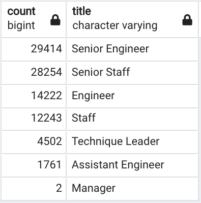
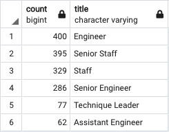

# Pewlett-Hackard-Analysis

## Overview of Project

The purpose of this project is to assist Pewlett Hackard create an employee database. The employee database is used to plan its upcoming retirements and employee headcount, specifically listing employees who will require retirement packages and what positions will need to be filled. This project aims to generate two reports:

1. The number of retiring employees per title
2. The employees who are eligible to participate in a mentorship program

## Results

The data preparation utilizes SQL by applying data modelling, data engineering and data analysis to generate reports. Insight are generated on the <a href="Queries/Employee_Database_challenge.sql">Employee Database</a>. 

### The Number of Retiring Employees by Title

This analysis will showcase the employees who will be retiring by generating 3 different reports:

1. Retirement Titles table
2. Unique Titles table
3. Retiring Titles table

**Retirement Titles**

The Retirement Titles table will showcase the number of retirement-aged employees. The table is filtered to show all the current employees who were born between January 1, 1952 and December 31, 1955. Insight are generated on the <a href="Data/retirement_titles.csv">Retirement Titles CSV File</a>.

**Unique Titles**

The Unique Titles table will create a table that contains the most recent title of each employee. In the Retirement Titles table, an employee can have multiple titles in the database. As a result, this table will help filter to only showcase the most recent title. Insight are generated on the <a href="Data/unique_titles.csv">Unique Titles CSV File</a>.

**Retiring Titles Table**

The Retiring Titles table will finalize the total number of retirement-aged employees by their most recent job title. Insight are generated on the <a href="Data/retiring_titles.csv">Retiring Titles CSV File</a>.

### The Employees Eligible for the Mentorship Program

This analysis will create a Mentorship-Eligibility table that holds the current employees who were born between January 1, 1965 and December 31, 1965. Insight are generated on the <a href="Data/mentorship_eligibilty.csv">Mentorship Eligibility CSV File</a>.

### Key Results ###

The key results from the two analysis conducted are: 

1. In the Retirement Titles table, there are many duplicate employees as employees may have had various roles during their career. In the first 10 rows there are only 6 unique employees instead of 10. This showcases that additional filtering and sorting is required. 

    

2. Wihtout filtering and sorting the data, in the Retirement Titles table, the most popular titles are Engineers, followed by Staff, followed by Senior Engineer. This showcases that the company relies heavily on engineers and staffs for their business. 

    

3. After removing the duplicate titles and filtering to only showcase the most recent roles, the most popular titles are Senior Staff, followed by Senior Engineer, followed by Engineer. This showcases that most of the employees who are retiring soon are more senior employees. 

    

4. Out of the thousands of employees, only 1,549 employees fit the criteria to be a mentor. The most popular job titles are Engineer, followed by Senior Staff then Staff.

    

## Summary

**1. How many roles will need to be filled as the "silver tsunami" begins to make an impact?**

After completing the analysis, there are 90,398 employeees that will need to be filled. The most senior roles will need to be filled, for example, the Senior Engineer and Senior Staff roles. 

**2. Are there enough qualified, retirement-ready employees in the departments to mentor the next generation of Pewlett Hackard employees?**

The analysis showcases that only 1,549 employees are eligible for mentorship. Under the assumption that Pewlett Hackard is planning on filling all the roles that will be impacted by retirement and that one mentor can only provide mentorship to one employee, then only ~1.5% of the new employees will have a mentor. Pewlett Hackard currently does not have enough qualified employees to be mentors.

Overall, in the upcoming future, it is recommended that Pewlett Hackard focuses on promoting and training their current employees, while hiring senior staff members to fill the upcoming gaps. 